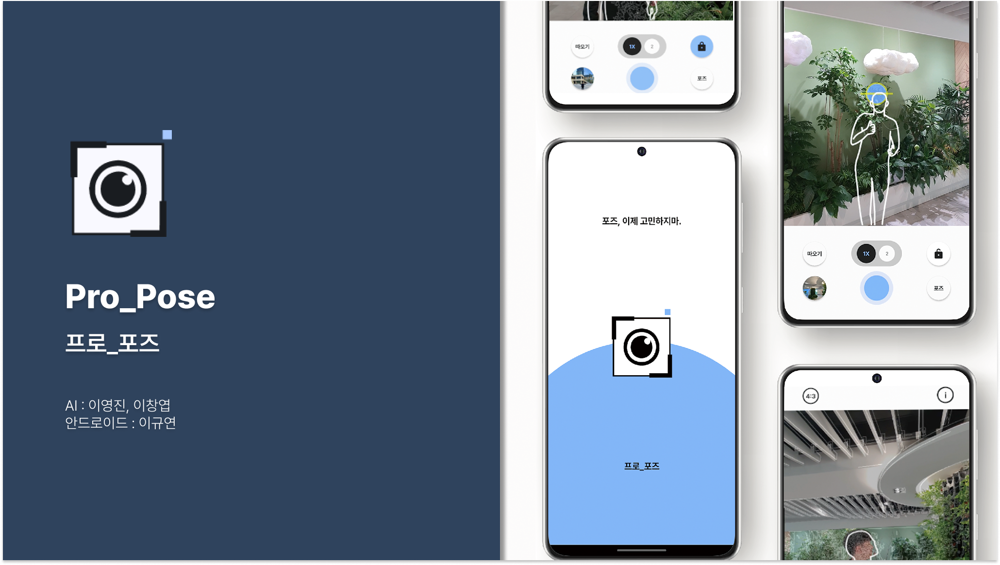
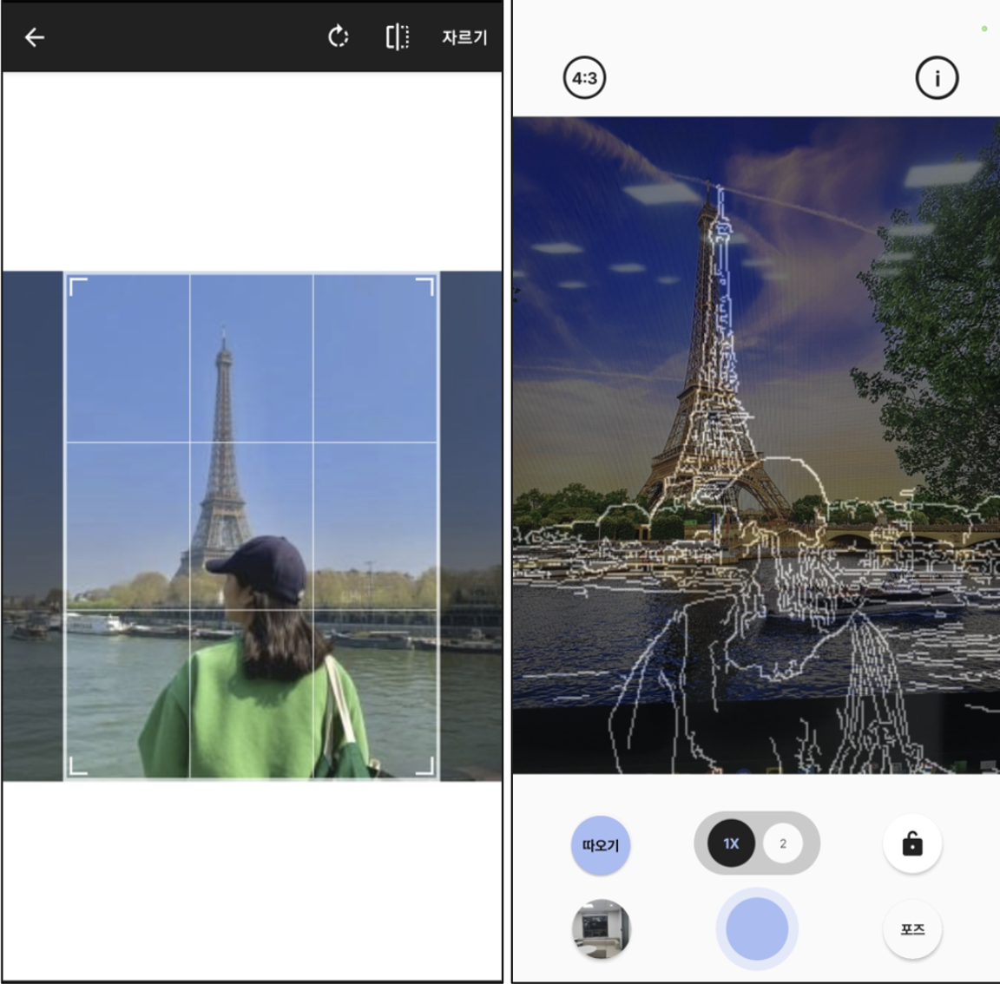
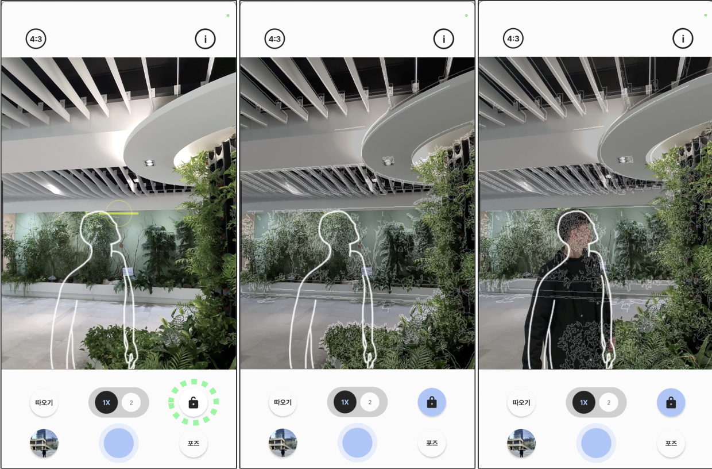
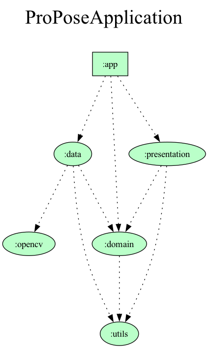

# Pro_Pose (프로_포즈)

## 🧏🏻‍♂️ About Me
Pro_Pose는 Pro와 Pose의 합성어로 "인물 사진 포즈의 프로"라는 모티브를 가지고 개발되었습니다.  
사진 SNS가 보편화된 요즘, 사진 촬영시 인물의 포즈에 대해 고민을 가지고 있는 사람들이 많이 있음을 알게 되었습니다.  
하지만 <u>Pro_Pose와 함께라면</u>, 포즈 추천 및 구도 가이드 기능을 통해, 인물 사진을 찍는 데 어려움을 더이상 겪지 않을 거에요!
 

## ⬇️ Download 

## ✨Features

| <b>포즈 추천</b>| <b>구도 가이드</b> |
  |---|---|
  | | |
  |AI가 화면에 비치는 카메라 화면을 분석하여, 적합한 포즈 이미지를 추천해줍니다. |AI가 화면에 비치는 카메라 화면을 분석하여, 안정적인 사진의 구도에 대한 가이드를 제공합니다.|

  

| <b>잠금</b>| <b>포즈 따오기</b> |
  |---|---| 
  |  |  |
  | <li> 사용자가 사진을 찍힌다는 상황을 고려 </li> <li> 추천 받은 구도와 포즈를 외곽선으로 추출</li> <li> 촬영해주는 사람이 어떤 식으로 찍어야 할 지 쉽게 전달할 수 있도록 도와줍니다.  |  <li> SNS 등에서 찾은 포즈나 사진 구도를 따라하고 싶은 경우 </li> <li> 해당 이미지의 외곽선을 검출 </li> <li>검출한 이미지를 현재 카메라 화면에 겹쳐보이게 하여, 쉽게 사용자가 따라서 찍을 수 있도록 도와줍니다.</li> ||

## Architecture

<table>
    <thead>
        <tr>
            <th><b>Dependency Graph</b></th>
            <th><b>Clean Architecture</b></th>
        </tr>
    </thead>
    <tbody>
        <tr>
            <td> </td>
            <td></td>
        </tr>
        <tr>
            <td colspan = "2">
             <li> 클린 아키텍쳐를 적용하여, Domain은 UI, Data를 모르게 하였고, 이를 통해 각 레이어의 <b>관심사를 분리</b> 하였습니다. </li><li> UI, Data 각각을 별개로 다룰 수 있게 되었고, 또 각각을 별개로 테스트할 수 있게 하여, 유지보수 성을 높일 수 있었습니다. </li> 
            </td>
        </tr>
    </tbody>
</table>

## Tech Stack 

| 구분 | 기술스택  |
|---|---|
|  **Architecture** |  MVVM, Clean Architecture |
| **Asynchronous Processing** |Kotlin Coroutine & Flow |
|**Jetpack Components**| Compose UI, Navigation, CameraX, DataStore |
| **Dependency Injection**|Dagger Hilt|
|**Data Analysis**| Firebase Analytics |
|**Image Processing**| Coil, OpenCV |
| **AI Model Launch**| Pytorch TorchVision |
| **Communication**| Jira, Notion |
|**Storage**| Google Drive, Github |
|**Design**| Figma |
